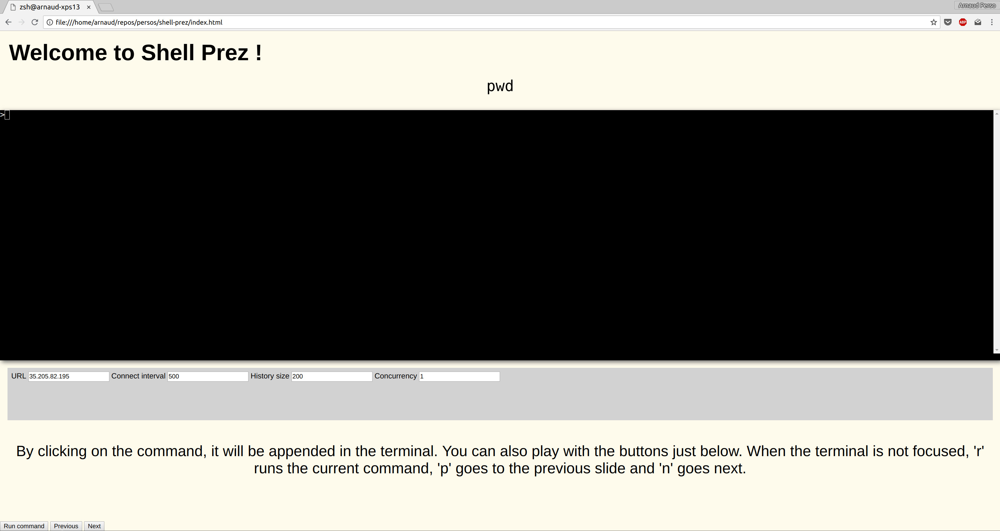

# Shell Prez

A simple toolkit for presenting command line executions.

Your presentation runs in a brower. A terminal connected to your local machine runs in the web page. Each slide talks about a CLI command.

## Compiling

Run the `./build.sh` script.

## Running

You have to launch a gotty server. The current linux version is available here :

`./gotty -w --ws-origin '.*' bash`

If you are not on Linux, you can download the Gotty release yourself here : https://github.com/yudai/gotty/releases.

Once launched, `gotty` will serve a websocket which will create some TTYs and link them to your browser.

Then in your browser, drop the index.html file. The URL should be something like `file:///some/path/ui/index.html`. The browser should display the demo with some slides.

## Shortcuts

Here are some shortcuts.

**The terminal should not have focus for the commands to work**

- `n` : next slide
- `p` : previous slide
- `r` : run current slide command